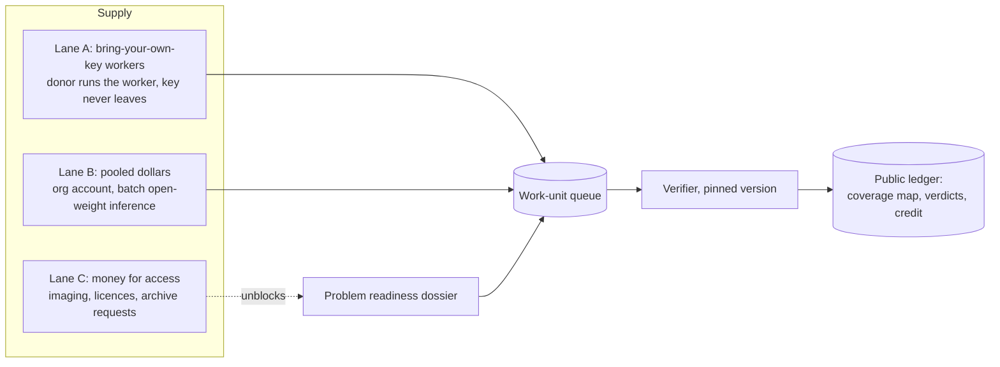
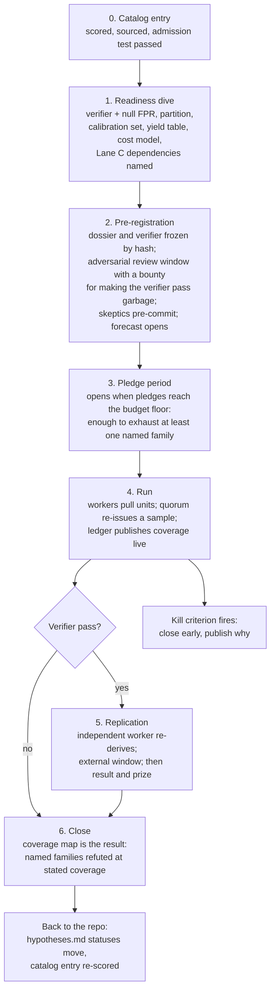

# The compute pool — a platform design

*Draft 2026-09-21. Builds on `ideas/pooled-compute.md` (the argument that the
verifier, not the compute, is the scarce input) and `rubric/COMPUTE-MODES.md`
(which of the 89 live entries are brute-forceable at all). External facts are
in `sources/pooled-compute-research.md` and
`sources/compute-pool-platform-research.md`. This file is architecture and
process, not features or UX.*

## The one-paragraph version

People hold unused API budget. Problems exist that would fall to a great deal
of inference if the inference were pointed at the right space and every
candidate were checked by a machine. The platform connects the two. It is
**not** a compute marketplace (OpenRouter already is one) and it does **not**
move anyone's credits (every vendor forbids that). It is a public queue of
verifiable work units. A problem enters the queue only once it has a
pre-registered verifier. A donor contributes by running a small worker on
their own machine, under their own API key with a hard spend cap, pulling
units and returning results. The ledger records coverage, not tokens. The
unit of account is a verified work unit, and the exchange rate between models
is measured on each campaign rather than asserted. The probability that a
campaign succeeds is never stated by the person proposing it.

## What the analogy gets right and wrong

The Navier–Stokes run (about ten thousand agents, four days, roughly 130
billion output tokens, a Lean verifier; see `sources/pooled-compute-research.md`)
is the right inspiration and the wrong template. It worked because three
things existed before the first token: a hypothesis space narrowed by a decade
of human work, a total mechanical verifier, and a partial-credit signal. The
compute supplied throughput over a space someone else had already shaped.

Compute-as-GoFundMe therefore needs a rule the GoFundMe analogy lacks:
**you cannot fund a problem, only a campaign, and a campaign cannot open
without a verifier.** The catalog is the list of problems. A campaign is a
pre-registered, bounded search with a stopping rule. The readiness work that
turns a problem into a campaign is itself a product, and this repository's
deep dives are that work.

The Abramelin dive is the calibration case. It ran on a shoestring, produced
frozen models that check a witness, and stopped at a wall that no amount of
compute breaches: the interiors of the squares cannot be computed, only
collated from manuscripts nobody has imaged. So the platform needs a second
currency, money for access, that never converts into the first.

## Primitives

Seven objects. Everything else is composition.

| Object | What it is | Who creates it |
|---|---|---|
| **Problem** | A catalog entry plus a readiness dossier: pinned corpus (hashes), hypothesis-space description, compute mode, model floor, non-compute dependencies | Coordinator (a deep dive) |
| **Verifier** | A versioned, open-source, deterministic program that takes a candidate and returns pass/fail, with a measured false-positive rate on null inputs; optionally a partial-credit score with its own null calibration | Coordinator, then adversarial review |
| **Campaign** | A pre-registered run against one problem: verifier version pinned, hypothesis families named, partition into units, budget floor and cap, stopping rule, kill criteria, what happens on a pass | Coordinator |
| **Work unit** | The atom of donation: `(campaign, unit id, input slice, recipe, seed, model floor, cost estimate, deadline)` | Scheduler, from the campaign's partition |
| **Pledge** | A donor's commitment: campaign, spend cap on their own key, models they will run, concurrency. Made real only by a worker actually running | Donor |
| **Result** | Worker output for one unit: candidates found, verifier verdicts, a receipt that inference ran, and the worker's coverage claim | Worker, checked by coordinator |
| **Ledger** | Public, append-only: which units are done and by whom, quorum status, verdicts, the coverage map, spend by lane | Coordinator; anyone can mirror |

Two kinds of work unit, because the compute modes differ:

- **Enumerative** (mode ENUMERATE, some SWEEP): deterministic. "Try keys
  1,000,000 to 1,010,000 of family F against the pinned ciphertext" or "align
  quatrains 40 to 60 against corpus shard 7." A second worker given the same
  unit must produce the same output. Verification of the coverage claim is
  exact comparison.
- **Sampled** (mode SAMPLE-VERIFY, most SWEEP): non-deterministic. "Given
  this region of hypothesis space and this seed, propose up to 50 candidate
  mappings and return the ones that pass the local pre-check." Two workers on
  the same unit produce different candidates. Verification of the coverage
  claim is statistical (yield per unit against the calibration set).

The recipe inside a unit is declarative: prompt program, tools the worker may
call, seed, model floor. The coordinator shapes the search; the donor supplies
throughput only. A donor who wants to change the search proposes a new
campaign.

## Three lanes, one queue

**Lane A** is the shape the request describes: "I have excess OpenRouter
budget, point it at this." The donor creates a key with a hard limit, runs
`worker --campaign X --budget 20`, and walks away. The coordinator never sees
the key. Nobody is paid. This is ordinary API use under every vendor's terms
checked so far (the transfer bans in the earlier brief are about moving
credits between accounts, which this never does); the platform-research brief
records the per-key limit mechanics and any acceptable-use clause that bears
on it.

**Lane B** is the earlier brief's conclusion: donated money in one
organization account, spent on batch open-weight inference at a hundredth to
a four-hundredth of frontier price. It drains the same queue. It needs a legal
entity or a fiscal sponsor. It is more efficient than Lane A per dollar and
less engaging; both are kept because Lane A costs the coordinator nothing and
needs no entity.

**Lane C** never touches the queue. It buys the thing that seven of the top
twenty-five entries are actually waiting on (a scan, a transcription, an
archive request). It is a separate ledger with separate accounting, and there
is no exchange rate between C and A/B, because pretending there is one is how
a project ends up spending tokens on a problem that needed a photograph.

## The unit of account

Three candidates fail:

- **Tokens.** Meaningless across models: the cheapest credible open model and
  the most expensive frontier model differ by about 450× in price and by an
  unknown factor in usefulness on any given campaign.
- **Dollars.** Lane A donors give inference, not money, and the same dollar
  buys wildly different amounts of it.
- **Agent-hours.** An hour of a weak model on a hard unit is not an hour of a
  strong one.

What works is the thing BOINC settled on twenty years ago for heterogeneous
CPUs: **credit for verified work, normalized by measured throughput.**

1. **Ledger truth is the work unit.** "Unit 4471 done, quorum agreed,
   verifier ran" is exact. Nothing is ever recorded in tokens.
2. **Planning unit: the reference agent-hour (RAH).** One RAH is the output a
   reference-class model produces in one hour of agentic work. The
   Navier–Stokes figures give the calibration: 130 billion output tokens over
   ten thousand agents and 88 hours is about 150,000 output tokens per
   agent-hour. A campaign card states its load in RAH so that "1,000 agents
   for 40 hours" and "40,000 RAH" mean the same thing.
3. **Exchange rates between models are measured per campaign, not assumed.**
   Every campaign ships a **calibration set**: a few hundred units with known
   answers (planted keys, planted source matches, held-out cells). Before
   opening, the coordinator runs the calibration set on each candidate model
   class and publishes a **yield table**: verified finds per unit, per dollar,
   per wall-clock hour. The yield table sets the model floor (the cheapest
   class that clears a stated yield threshold) and the credit conversion
   (a donor running a model with 60 % of reference yield earns 0.6 RAH per
   unit). The yield table is itself a research output: it says, for this
   problem, how much model quality matters.
4. **Credit is for verified units, never for tokens burned.** A donor who
   returns fabricated "nothing found" results earns nothing once quorum
   catches them, and a donor who runs a cheap model that happens to work on
   this campaign earns full credit for it.

Lane C is denominated in currency and stays there.

## The campaign card: the metrics

Every campaign publishes one card. The fields are the metrics the request
asked for, made precise enough that a stranger can dispute them.

| Field | Meaning | How it is set |
|---|---|---|
| **Readiness** | Corpus pinned; verifier pre-registered with null FPR; partition exists; calibration set exists. All four or the campaign does not open | Checklist, gated |
| **Mode** | ENUMERATE / SAMPLE-VERIFY / SWEEP, from `COMPUTE-MODES.md` | Dossier |
| **Verifier strength** | Total-mechanical, or partial with a stated false-positive rate on synthetic nulls and on known-wrong readings | Measured, published with the verifier |
| **Signal** | Does a partial result give a gradient? YES / WEAK / NO. NO means the campaign is blind sampling and its card must say so | Dossier |
| **Parallelism** | How many units are independent, and where the knee is: for enumerative work, all of them; for sampled work, the point at which new workers mostly re-find each other's candidates (measured on the calibration set as duplicate rate versus worker count) | Measured |
| **Load** | RAH to reach the stopping rule. Enumerative: units × cost per unit, exact. Sampled: the budget cap, with the novelty stopping rule stated (stop when the duplicate rate exceeds X) | Computed |
| **Model floor** | Cheapest model class that clears the yield threshold on the calibration set | Yield table |
| **Coverage the budget buys** | Which hypothesis families are exhausted at the cap, which are sampled, which are untouched | Arithmetic from the partition |
| **P(family is right)** | The belief that the covered families contain the answer at all | **Not set by the proposer.** A forecast market or a panel, linked, with its history visible |
| **Non-compute dependencies** | Lane C items that must land first, with cost | Dossier |
| **Kill criteria** | Conditions under which the campaign stops early: verifier broken by adversarial review, calibration yield collapses, duplicate rate saturates | Pre-registered |
| **On pass** | Automatic replication by a second independent worker; publication of the candidate and the mapping; an external replication window; only then a result, and only then any prize | Pre-registered |

The split between the last two numerical rows is the crank filter. "1,000
agents for 40 hours gives a 70 % chance of cracking the Voynich" is two claims
glued together. The first, what coverage 40,000 RAH buys, is arithmetic the
proposer must show. The second, that the covered families contain the answer,
is a belief, and the proposer is the one person who must not set it. The
platform makes the sentence structurally impossible to state.

## Process: from catalog entry to closed campaign

Step 1 is what a deep dive in this repository is for, and it changes what a
dive's finished state looks like. A Voynich dive that ends with "here is a
verifier, here is its false-positive rate on Newbold, Cheshire, Rugg-table
gibberish and Timm–Schinner output, here is the partition of the cipher-family
space, and here is why no honest partial-credit signal exists yet" is a
complete dive and the only thing that makes a campaign possible.

Step 6 is why a campaign is worth running even when the forecast is low. Full
coverage of a named hypothesis family with a pre-registered verifier is a
refutation, and a refutation at stated coverage is a result that survives.
The catalog's rule that a hypothesis dies on the page scales to this: the
coverage map is the page.

## Trust model

Who is trusted with what:

| Party | Trusted to | Not trusted to | Check |
|---|---|---|---|
| Donor / worker | Run inference | Report honestly, or run at all | Verified candidates are self-certifying (coordinator reruns the verifier). Coverage claims are not: a sampled fraction of units (say 5 to 10 %) is re-issued to a second donor, exact comparison for enumerative units, yield comparison for sampled ones. A receipt from the provider (a generation id the coordinator can query for cost and token counts) is a second, cheaper check. Failures forfeit credit and raise the re-issue rate for that donor |
| Coordinator | Shape the search, run the verifier, keep the ledger | Change the verifier mid-campaign, hide negative results, misreport coverage | Verifier and dossier are hash-pinned at pre-registration. Ledger is public and mirrorable. Anyone can rerun any verdict |
| Verifier | Say pass or fail | Be right | Null FPR measured before opening; adversarial window with a bounty; pinned version; a campaign whose verifier breaks is killed, not patched in place |
| Model vendor | Serve tokens | Anything about results | Nothing in the design depends on vendor cooperation; results are checked locally |
| Forecast | Aggregate belief | Be well calibrated | Its history is public; the campaign card links, never quotes a single number as its own |

The asymmetry the whole design rests on: generating a candidate is expensive,
checking one is cheap. Where that asymmetry does not hold (JUDGE-mode entries,
anything whose verifier is a panel of scholars), the queue has nothing to
offer, and the honest card says so.

Attestation schemes that inspect model activations do not apply to black-box
API calls, so Lane A cannot borrow that machinery; quorum and provider
receipts are what remain, and they are enough because the expensive thing to
fake is a verified candidate, and that cannot be faked at all.

## Architecture

Five components. The first version of every one of them is small.

1. **Coordinator service.** Problem and campaign registries, the scheduler
   (hands out units, tracks deadlines, re-issues stale or quorum-sampled
   units), result intake, verifier execution, ledger writes. A single
   process with a database behind it is enough for the first several
   campaigns; distributed.net ran on less.
2. **Worker.** A command-line program a donor runs. It reads a campaign id
   and a spend cap, pulls a unit, executes the recipe against the donor's
   own provider under the donor's own key, runs the campaign's local
   pre-check to avoid uploading obvious misses, submits the result with the
   provider receipt, and stops when the cap is spent. It must be small enough
   to audit in an afternoon, because the donor is trusting it with a key.
3. **Verifier packages.** One per campaign, installable, deterministic, with
   a test suite that includes every known-wrong reading. Versioned by hash.
   Runs both inside the worker (pre-check) and at the coordinator (verdict).
4. **Ledger.** Append-only, public, exportable as flat files. The coverage
   map is a view over it. For the first campaigns this can be a git
   repository, which is what this repository's `analysis/` folders already
   are.
5. **Recipe format.** A declarative description of one unit's job: prompt
   program, allowed tools, seed, model floor, expected cost. Recipes live in
   the campaign dossier and are the thing adversarial reviewers read.

Not components: a token exchange, a wallet, a chain. The ledger is a table,
and the incentives (credit, a leaderboard, authorship on the coverage
result) do not need to be money.

## Where the first campaigns come from

`COMPUTE-MODES.md` finds eleven HIGH-fit entries. The order to open them in
is the order that tests the machinery on something that can actually pass or
fail:

1. **D'Agapeyeff** (ENUMERATE, 196 characters, small system family, exact
   ciphertext). The RC5-56 of the pool: the shakedown campaign where the
   scheduler, quorum, receipts and yield table get exercised on a problem
   whose total load is small enough to run end to end in days. The card's
   honest weakness: the verifier is n-gram scoring against a small family,
   so the FPR has to be measured carefully.
2. **A sweep** (Atalanta Fugiens or Hisperica Famina). Sweeps have honest
   partial credit (verbatim match length against a corpus the searcher does
   not control) and an enumerable partition (corpus shards). This tests the
   sampled-unit path and the yield table across model classes.
3. **Voynich**, only as a refutation campaign. SAMPLE-VERIFY with no honest
   signal means the card cannot promise a decipherment; it can promise full
   coverage of named cipher families under a verifier that has been shown to
   reject the known-wrong readings, and it can publish the yield table for
   what model quality buys on this problem. That is a result the field does
   not have.

Derveni and the rest of the IMAGE-mode top twenty-five are Lane C campaigns
and never enter the queue until a readable text exists.

## What "1,000 agents for 40 hours" costs

Output tokens only, at the 150,000-per-agent-hour calibration; input tokens
in an agentic loop add roughly a factor of two to four in dollars depending
on caching, so treat these as floors.

| Model class | $/M output | 40,000 RAH ≈ 6 B output tokens |
|---|---|---|
| Frontier (Opus 5 list) | 25.00 | $150,000 |
| Strong open (deepseek-v4-pro) | 3.20 | $19,200 |
| Cheap open (deepseek-v4-flash) | 0.11 | $660 |

Prices are the ones recorded in `sources/pooled-compute-research.md`; recompute
when they move. The point of the table is the ratio, not the totals: whether
the cheap class is usable is exactly what the yield table measures, and on an
enumerative campaign it usually will be, because the model is proposing and
the verifier is deciding.

## Risks, in the order they will bite

1. **Verifier scarcity.** Eleven of eighty-nine entries are HIGH fit, and
   only a few of those have a mechanical verifier written today. The queue
   will be nearly empty for a long time. That is correct behaviour; the
   readiness dive is the product, and an empty queue with a full list of
   named walls is more honest than a full queue of unverifiable campaigns.
2. **Blind sampling dressed as search.** A SAMPLE-VERIFY campaign without a
   partial-credit signal is many agents wandering. The card's Signal field
   exists so this is visible before the pledges arrive.
3. **Coverage lies.** A donor returns "nothing found" without running.
   Quorum sampling plus receipts plus credit-only-for-verified-units bound
   the damage; the re-issue rate is a tunable cost.
4. **The probability number.** It is the crank magnet and the fundraising
   hook at once. Taking it away from the proposer and giving it to a
   forecast is the single most important design decision here, and the one
   that will be argued with most.
5. **Lane A efficiency.** Per-key rate limits, retail pricing and no batch
   discount make Lane A several times more expensive per unit than Lane B.
   Lane A's value is engagement and the absence of a legal entity, not
   efficiency. A campaign should say which lane its budget floor assumes.
6. **Legal shape.** Lane A needs nothing: no money moves and no key leaves
   the donor. Lanes B and C need a fiscal sponsor or a nonprofit, and the
   earlier brief's open question (whether any vendor's enterprise agreement
   lets a nonprofit accept donated credits) is still open.
7. **The vendor changes the rules.** A per-key spend cap or a generation
   receipt is a product feature, not a promise. The worker must degrade to
   a local spend counter if a provider removes them.

## What this changes in this repository

- A deep dive's finished state gains a definition: a campaign dossier
  (verifier with null FPR, partition, calibration set, yield table, cost
  model, Lane C list) or a named wall saying which of those cannot be built.
- `rubric/CALIBRATION.md` (TK-003) should split `compute` into a readiness
  component, as `pooled-compute.md` already argues; the campaign card's
  Readiness row is that component made explicit.
- `puzzles/_template/` could carry a `CAMPAIGN.md` stub with the card's
  fields, filled only when a dive reaches step 1. Not done in this pass.
- The Abramelin dive should be re-read as a Lane C case: its frozen models
  are a verifier fragment, and its wall is a purchase order.

## Open questions

- Is a sampled fraction of 5 to 10 % re-issue enough quorum for sampled
  units, or does yield comparison need a larger sample to be discriminating?
  Settle empirically on the D'Agapeyeff shakedown.
- Should credit be transferable between campaigns (a donor's standing) or
  scoped to one campaign? Scoped is simpler and resists gaming; standing is
  what makes people come back.
- Who runs the adversarial review of a verifier, and what is the bounty
  denominated in, given Lane A has no money?
- Whether a forecast market on an obscure cipher ever has enough liquidity
  to mean anything, or whether a small named panel with a public track
  record is the honest substitute.
