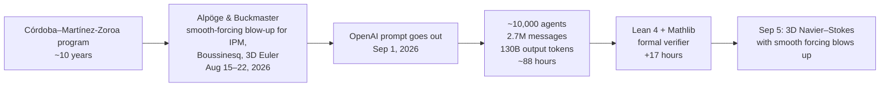
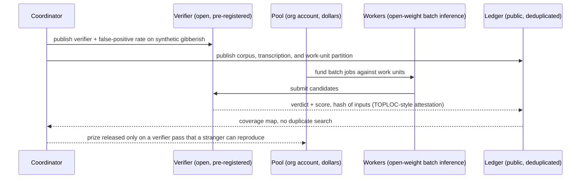

# Pooled compute for unsolved texts

*Draft 2026-09-15. Sources: `sources/pooled-compute-research.md` (external facts, all
URL-cited) and `rubric/COMPUTE-MODES.md` (per-entry classification of the catalog).*

## The idea

OpenAI resolved a Navier–Stokes blow-up problem in September 2026 by running about
ten thousand agents for four days and spending roughly 130 billion output tokens.
Individuals cannot do that. But millions of individuals hold API credits and
subscription allowances they do not use. SETI@home pooled idle CPUs in 1999;
distributed.net pooled them to brute-force RC5 keys. Is there a structure that lets
people who care about the Voynich manuscript pool tokens toward it?

Short answer: yes, but not the way the question is usually asked. Tokens are the
cheap part. What the Navier–Stokes run actually had, and what almost every text in
our catalog lacks, is a verifier.

## What actually happened with Navier–Stokes



Three things the headline leaves out:

- **The space was already narrowed.** Buckmaster's public statement says the first
  OpenAI prompt was sent after word of his and Alpöge's results reached OpenAI, and
  that the claim of "very little human input" turned out not to be true. The tokens
  finished a known route. They did not search a raw space.
- **The verifier was total and mechanical.** Lean either accepts the proof or it does
  not. Every one of the 2.7 million messages could be scored against that.
- **The prize was not awarded.** Clay says the problem "has apparently been settled."
  The result is blow-up *with a smooth forcing term*, which resolves two of Fefferman's
  four alternatives, not the unforced regularity question most people mean.

Cost at retail, for the same 130B tokens:

| Model | $/M output | 130B tokens |
|---|---|---|
| GPT-6 Astra | 50.00 | $6.5M |
| Claude Opus 5 | 25.00 | $3.25M |
| Gemini 3.8 Flash | 3.75 | $488K |
| deepseek-v4-pro | 3.20 | $416K |
| glm-5.3-flash | 0.33 | $43K |
| deepseek-v4-flash | 0.11 | $14K |

Batch APIs halve the majors. The cheapest credible open-weight run is about 450×
cheaper than the most expensive frontier run. That ratio decides what "pooling"
should pool.

## Four properties make a problem token-brute-forceable

| Property | Navier–Stokes | Voynich |
|---|---|---|
| Digitized inputs | yes | yes (EVA transcriptions) |
| Samplable hypothesis space | yes, narrowed by theory | yes, infinite |
| Cheap total verifier | Lean | **none** — "is this a decipherment?" is a judgment |
| Partial-credit signal to steer search | proof progress, lemma checks | **none honest** — every scoring function is what manufactures the field's false positives |

Compute only ever supplies the second column's throughput. The other three have to
exist before the first token is spent. Voynich has two of four. The two it lacks are
the two that matter.

## How our ranking maps onto this

The `attackable` score double-weights `compute`, but `compute` lumps together seven
different things a computer might do. Classifying all 89 live entries by what the
computation actually is:

```text
89 live entries, by compute mode
  SWEEP          23   mass source-parallel search over digitized corpora
  ENUMERATE      22   finite key / rule / alignment space with a mechanical check
  IMAGE          14   scanning, virtual unwrapping, RTI, handwriting recognition
  JUDGE          12   humanistic interpretation; computation is a minor aid
  ATTRIBUTE      10   stylometry, dating, authorship
  DESCRIBE        6   statistics that narrow hypothesis families without decoding
  SAMPLE-VERIFY   2   model proposes candidates, hard constraints check them
                      (the Navier–Stokes pattern: Voynich, Rohonc)

Token-brute-force fit:  HIGH 11   MEDIUM 29   LOW 49
```

Only eleven entries are places where pooled tokens in a generate-and-verify loop
could plausibly move anything. They fall into exactly two families:

```text
Rule or key search, mechanical check, text already exactly transcribed
  #2  Voynich Manuscript          (verifier still to be built — see below)
  #9  Book of Abramelin squares   (regenerate one witness, predict another's gaps)
  #16 Man'yōshū poem 9            (12 graphs, 4,500-poem corpus of attested values, metre as constraint)
  #28 Cicada 3301 Liber Primus
  #39 Beale ciphers 1 and 3       (fit HIGH, solvable 2: probably nothing there)
  #44 Virgilius Maro Grammaticus  (author states the scinderatio rules; run them backwards)
  #72 D'Agapeyeff cipher          (smallest; exact ciphertext; n-gram gradient)

Source-parallel sweep, object and target corpus both machine-readable
  #3  Atalanta Fugiens
  #12 Hypnerotomachia Poliphili
  #15 Hisperica Famina
  #55 Nostradamus                 (source identification, not prophecy)
```

And the ranking misleads in both directions:

```diff
 Top 25 by attackable, but tokens alone do nothing (bottleneck is an object, not a search)
-  #1  Herculaneum papyri        synchrotron beamtime, segmentation, ink detection
-  #5  Egyptian enigmatic writing corpus exists only as print transliterations
-  #8  Khunrath, Amphitheatrum   plates never imaged at a resolution that resolves the lettering
-  #14 Clavis Artis              German cursive never transcribed; HTR is the whole job
-  #17 Rohonc Codex              method settled, but no confirmed machine-readable sign sequence
-  #19 Toynbee tiles             naming the tiler needs physical evidence
-  #24 Derveni Papyrus           needs the Vesuvius treatment; not volumetrically scanned

 Below 40 by attackable, but genuinely brute-forceable (depressed by mystery or solvable, not by method)
+  #44 Virgilius Maro Grammaticus
+  #55 Nostradamus
+  #72 D'Agapeyeff cipher
```

The lesson for the rubric: `compute` should be split. A "readiness" component
(is there a machine-readable text and a program-checkable test today?) is what
pooled tokens can act on. The rest is what a coordinator with archive access has to
buy first. This goes to `rubric/CALIBRATION.md` (TK-003).

## What pooling has done before

```text
distributed.net  RC5-56   250 days                               1997   solved
                 RC5-64   1,757 days, 327,856 participants       2002   solved
                 RC5-72   15.7% complete after 23 years          2026   running
SETI@home        5.2M participants at peak                       1999–  found nothing
Folding@home     2.43 exaflops                                   2020   real science, no single "answer"
GIMPS            latest Mersenne prime: one person, rented A100s 2024   solved
Vesuvius         $2.14M pooled prize money + open data           2023–  PHerc. 1667 read end to end, 2026
```

Two readings. Pooling volunteers buys a constant factor, never an exponent:
distributed.net's third key has taken 23 years so far. And the two recent wins that
look like pooling were not pooling of *accounts*: the Mersenne prime came from one
person renting cloud GPUs, and the Vesuvius Challenge pooled money and data, then let
competitors bring their own compute against an open verifier (papyrologists reading
the flattened output).

## You cannot pool tokens

Every vendor forbids it, in writing:

- OpenAI Service Credit Terms: "We prohibit and do not recognize any purported
  transfers, sales, gifts, or trades of Service Credits." Business Terms ban
  transferring API keys or sharing credentials.
- Anthropic consumer terms: "You may not share your Account login information,
  Anthropic API key, or Account credentials with anyone else." (Anthropic's stance on
  credit *transfer* specifically could not be fetched; the sharing ban is confirmed.)
- OpenRouter: credits are "non-transferable, including between accounts."

So ChatGPT Plus and Claude Max allowances cannot be redirected, and API credits
cannot be donated. The one sanctioned shape is an **organization account** with pooled
dollars and invited users. Given the 450× price ratio above, the pooled dollars should
buy open-weight batch inference, not frontier subscriptions. That also removes the
model vendor from the trust model.

## The structure that would work

Name it for what it does: a verifier-first pooled search. The verifier is the
product; the compute is a commodity bought with the pool.



The parts, in the order they must exist:

1. **A pre-registered verifier with a measured false-positive rate.** Run it on
   synthetic gibberish and on known-wrong decipherments first. If it passes Newbold or
   Cheshire on Voynich, it is not a verifier. Publish the rate. This is the step every
   Voynich claimant skips and the step no amount of compute can supply.
2. **A partial-credit score derived from the verifier**, not from "looks like Latin."
   For a cipher: fraction of text that decrypts under one stated mapping into text
   that passes a language model's perplexity gate *and* a held-out folio the searcher
   never saw. For a source sweep: verbatim match length against a corpus the searcher
   does not control.
3. **Open corpus and a work-unit partition** so donors do not re-search each other's
   space. distributed.net solved this in 1997; Prime Intellect's TOPLOC hashing is the
   current answer for attesting that an inference actually ran.
4. **Pooled dollars in an org account** buying open-weight batch inference.
5. **A prize that pays on a verifier pass**, Vesuvius-style, released only when a
   stranger reproduces the pass from the published mapping.

## Platform design

The platform that would run this is designed in `compute-pool-design.md`:
primitives, lanes, unit of account, campaign card, trust model, process.

## What this means for this repo

- Deep dives should treat the verifier as the first deliverable, not the decipherment.
  A Voynich dive that ends with "here is a verifier, here is its false-positive rate
  on five known-bad readings, and here is why no honest partial-credit signal exists
  yet" is a complete result and the precondition for anyone ever pooling anything.
- The first pooled target should not be Voynich. It should be the smallest HIGH-fit
  entry with a mechanical check and an exact text, so the pooling machinery is tested
  on something that can actually pass or fail: **D'Agapeyeff** (196 characters, small
  system family) or **Abramelin** (discrete grids, regenerate-and-predict). RC5-56
  before RC5-64.
- The second target is a sweep, because sweeps have honest partial credit and the
  corpora exist: **Atalanta Fugiens** or **Hisperica Famina**.
- Seven of our top 25 need an archive, a scanner, or a paleographer before a token is
  worth spending. That is a different pool: money for imaging, Vesuvius-style. Derveni
  is the obvious candidate; the Vesuvius pipeline exists and the object has not been
  scanned.

## Open questions

- Is there a legal structure short of a company that can hold an org account and
  receive pooled dollars from strangers? (Gitcoin-style quadratic funding and Manifund
  were not verified in this pass.)
- Does any vendor's enterprise agreement permit a nonprofit to accept donated
  credits? Unverified; the consumer and standard business terms say no.
- For Voynich specifically: can a partial-credit signal be built that does *not*
  reward Latin-looking output, given that the hoax-generator hypothesis (Rugg, Timm &
  Schinner) predicts Latin-looking output too?
